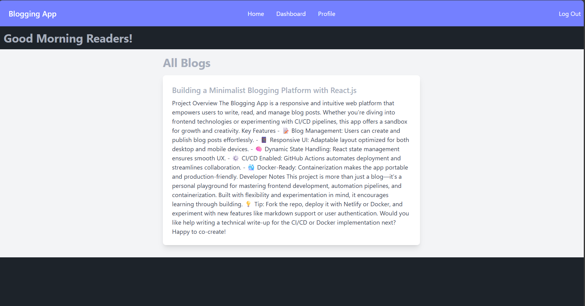
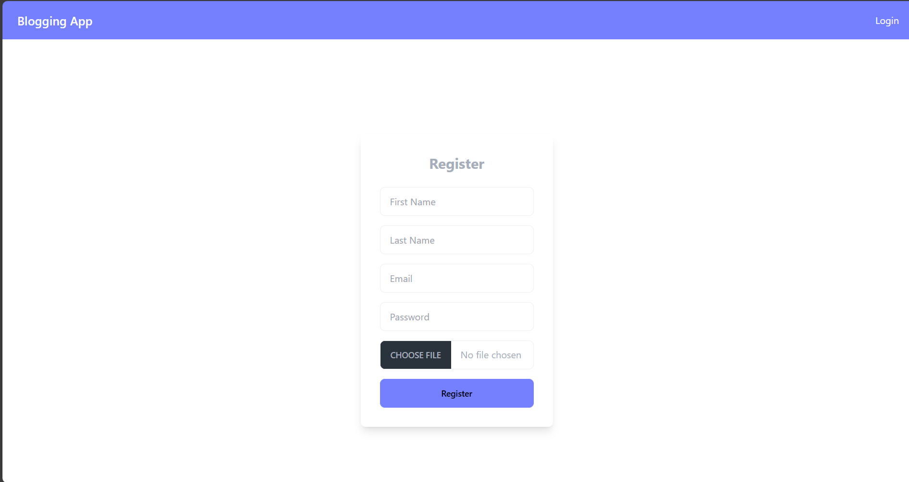

# 📝 Blogging App (React.js)

A modern and responsive blogging web application built with **React.js**. This app allows users to write, read, and manage blog posts in a clean interface. It also integrates a basic CI/CD pipeline using **GitHub Actions** and supports containerization via **Docker**.

---

## 📸 Screenshots

| Homepage | Blog View |
|----------|-----------|
|  |  |

---

## 🚀 Features

- 🖊️ Create, edit, and delete blog posts
- 🌙 Light/Dark theme (if implemented)
- 🔍 Search and filter blogs
- ⚙️ CI/CD using GitHub Actions
- 🐳 Docker-ready

---

## 🛠️ Tech Stack

| Purpose        | Technology     |
|----------------|----------------|
| Frontend       | React.js       |
| Routing        | React Router   |
| Styling        | CSS / Bootstrap|
| CI/CD Pipeline | GitHub Actions |
| Containerization| Docker        |

---

## 🐳 Docker Commands

```bash
# Step 1: Build Docker image
docker build -t my-app .

# Step 2: Run the app
docker run -p 3000:80 my-app
```

Then open your browser at [http://localhost:3000](http://localhost:3000)


## 🙋‍♀️ Author

**Kavya Vachhani**  
[GitHub Profile](https://github.com/Kavyvachhani-fxis)
